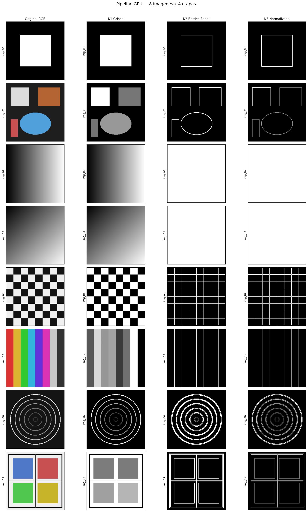

# Pipeline de Procesamiento de Imagenes en GPU

**Curso:** Introduccion al Computo en GPU

## Equipo

| Nombre | GitHub |
|---|---|
| Jacobo Rodriguez | jacoborodriguez17 |
| Jesus Olivas Martinez | JesusOliv4s |
| Valeria Guitron Ortega | valeria-guitron |

---

## Descripcion del pipeline

El sistema recibe un batch de 8 imagenes RGB y las procesa completamente en GPU a traves de 4 kernels encadenados. Los datos no tocan la CPU entre kernels — solo hay una transferencia H→D al inicio y una D→H al final.

```
Batch (B×3×H×W) → K1 Grises → K2 Bordes → K3 Normalizacion → K4 MSE/RMSE → vector B valores
```

### Kernel 1 — Escala de grises (Jesus Olivas Martinez)
Convierte cada imagen RGB a escala de grises aplicando la formula ponderada `0.2989·R + 0.5870·G + 0.1140·B`. Usa un grid 2D con bloques de 16×16 threads y un loop interno sobre el batch. Reduce la dimension de 4D (B×3×H×W) a 3D (B×H×W).

### Kernel 2 — Deteccion de bordes Sobel (Valeria Guitron Ortega)
Aplica el filtro Sobel en X y en Y sobre cada imagen en escala de grises y calcula la magnitud del gradiente `sqrt(Gx² + Gy²)`. Los pixeles del borde de la imagen se dejan en 0. Grid 2D con bloques de 16×16.

### Kernel 3 — Normalizacion (Jacobo Rodriguez)
Normaliza cada imagen al rango [0, 1] en dos pasos:
- **Paso A:** reduccion en arbol con `__shared__` para encontrar el valor maximo de cada imagen (un bloque por imagen).
- **Paso B:** division de cada pixel entre su maximo correspondiente con grid 2D.

### Kernel 4 — MSE / RMSE (Jacobo Rodriguez)
Calcula el error cuadratico medio entre cada imagen normalizada y la imagen de referencia (imagen 0 del batch), usando reduccion en arbol con `__shared__`. Produce un valor de RMSE por imagen (salida 1D de B valores).

---

## Compilar y ejecutar

### En Google Colab

```bash
# 1. Clonar el repo
git clone https://TOKEN@github.com/jacoborodriguez17/proyectofinal-gpu.git
cd proyectofinal-gpu

# 2. Descargar dependencias y crear carpetas
bash setup_colab.sh

# 3. Subir 8 imagenes a imagenes/ (img_00.png a img_07.png, mismo tamano)

# 4. Compilar
nvcc -O2 -o pipeline main.cu kernels/grises.cu kernels/bordes.cu \
     kernels/normalizar.cu kernels/mse.cu utils/imagen.cu utils/timer.cu -lm

# 5. Ejecutar
./pipeline
```

### Salidas generadas

```
resultados/
├── imagen_00_original.png
├── imagen_00_grises.png
├── imagen_00_bordes.png
├── imagen_00_normalizada.png
├── verificacion_pipeline.png
└── rmse_por_imagen.txt
```

---

## Verificacion visual



---

## Tiempos medidos en GPU (Google Colab T4)

Batch: 8 imagenes de 256×256 pixeles.

| Etapa | Tiempo (ms) |
|---|---|
| Transferencia H→D | 2.217 |
| Kernel 1 — Grises | 107.798 |
| Kernel 2 — Bordes Sobel | 25.069 |
| Kernel 3 — Normalizacion | 28.117 |
| Kernel 4 — MSE/RMSE | 18.023 |
| Transferencia D→H | 2.264 |
| **Total pipeline** | **183.488** |
| Pipeline CPU equivalente | 8.547 |
| **Speedup** | **0.05x** |

> El speedup es menor a 1 porque el batch es pequeno (8 imagenes de 256×256). El overhead de lanzamiento de kernels domina sobre el computo real. Con imagenes mas grandes o batches mayores el speedup de la GPU seria significativamente mayor.

---

## Valores de RMSE por imagen

Referencia: imagen_00. RMSE = 0 indica que la imagen es identica a la referencia.

| Imagen | RMSE |
|---|---|
| imagen_00 | 0.000000 |
| imagen_01 | 0.163113 |
| imagen_02 | 0.138749 |
| imagen_03 | 0.152300 |
| imagen_04 | 0.146121 |
| imagen_05 | 0.135364 |
| imagen_06 | 0.199792 |
| imagen_07 | 0.136162 |

---

## Justificacion del tamano de bloque

Se usaron bloques de **16×16 = 256 threads** para los kernels de imagen (K1, K2, K3B). Este tamano es multiplo de 32 (un warp), ocupa 8 warps por bloque y permite que cada SM oculte latencias de memoria global con suficiente paralelismo de threads en vuelo simultaneo.

Para los kernels de reduccion (K3A y K4) se usaron bloques de **256 threads en 1D**, lo que permite cubrir imagenes de hasta 256×256 pixeles con un solo bloque por imagen y aprovechar al maximo la memoria compartida.
